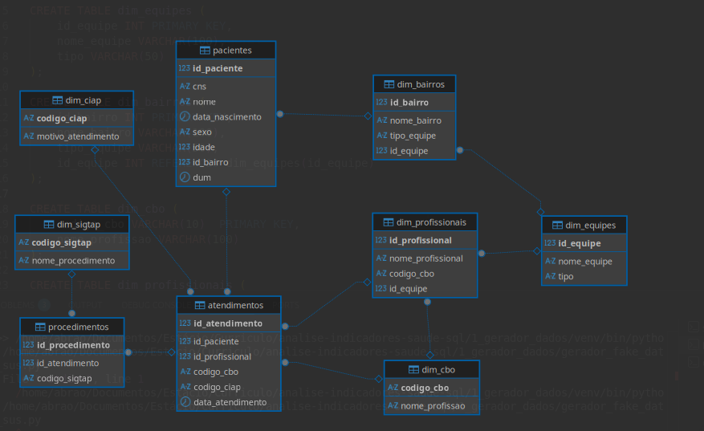

# 2 — Banco de Dados

Script SQL para criação da estrutura do banco de dados no DBeaver (PostgreSQL), pronto para receber os CSVs gerados pelo script da pasta anterior.

---

## Modelo de dados

O banco segue o modelo **estrela (star schema)**, com tabelas de fato no centro e tabelas dimensão ao redor. Esse padrão é o mais comum em projetos de Business Intelligence e facilita consultas analíticas com `JOIN`.

```
dim_equipes ◄─── dim_bairros ◄─── pacientes
                                      │
dim_cbo ◄─── dim_profissionais ◄── atendimentos ──► dim_ciap
                                      │
                                  procedimentos ──► dim_sigtap
```

---

## Tabelas

**Dimensões** — tabelas de apoio que descrevem os códigos:

| Tabela | Chave | Descrição |
|---|---|---|
| `dim_equipes` | `id_equipe` | Equipes de Saúde da Família da UBS |
| `dim_bairros` | `id_bairro` | Bairros com vínculo à equipe responsável |
| `dim_cbo` | `codigo_cbo` | Tipos de profissional (CBO) |
| `dim_profissionais` | `id_profissional` | Profissionais com nome, CBO e equipe |
| `dim_ciap` | `codigo_ciap` | Motivos de atendimento (CIAP-2) |
| `dim_sigtap` | `codigo_sigtap` | Procedimentos e exames do SUS (SIGTAP) |

**Fatos** — tabelas com os dados principais:

| Tabela | Chave | Descrição |
|---|---|---|
| `pacientes` | `id_paciente` | Cadastro com CNS, nome, sexo, idade e bairro |
| `atendimentos` | `id_atendimento` | Registro de cada consulta realizada |
| `procedimentos` | `id_procedimento` | Exames vinculados a cada consulta (1:N) |

---
## Diagrama de Entidade-Relacionamento

Diagrama gerado pelo DBeaver após a criação e importação dos dados:



## Como usar

**1. Abrir o DBeaver e conectar em um banco PostgreSQL**

**2. Executar o script:**

- Abra um novo Script SQL (`Ctrl + ]`)
- Cole o conteúdo do arquivo `schema.sql`
- Execute com `F5`

**3. Importar os CSVs na ordem correta:**

A ordem é obrigatória por causa das chaves estrangeiras — uma tabela só pode ser importada depois das tabelas que ela referencia.

```
1. dim_equipes
2. dim_bairros
3. dim_cbo
4. dim_profissionais
5. dim_ciap
6. dim_sigtap
7. pacientes
8. atendimentos
9. procedimentos
```

**Como importar cada arquivo no DBeaver:**
1. Clique com botão direito na tabela
2. Escolha *Importar Dados* → CSV
3. Verifique: separador = vírgula, encoding = UTF-8
4. Avançar → Iniciar

---

## Tecnologias

- PostgreSQL
- DBeaver
